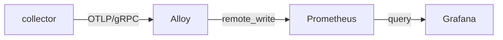

# PureGym Attendance Tracker

Polls the PureGym API for real-time gym occupancy and exports the data as OpenTelemetry metrics into a Prometheus + Grafana stack.

## Architecture



| Component | Role |
|-----------|------|
| **collector** | Go service that authenticates with PureGym, polls occupancy on an interval, and emits OTel metrics |
| **Alloy** | Receives OTLP metrics, batches them, and forwards to Prometheus via remote_write |
| **Prometheus** | Long-term metrics storage (5 year retention) |
| **Grafana** | Dashboarding and alerting |

## Prerequisites

- Docker & Docker Compose

## Quick Start

```bash
cp .env.example .env
# Fill in your PureGym credentials and gym ID in .env

docker compose up -d --build
```

Grafana is available at `http://localhost:6060` (default credentials: `admin`/`admin`).

The occupancy metric is available in Prometheus as `puregym_gym_occupancy`.

## Configuration

| Variable | Required | Default | Description |
|----------|----------|---------|-------------|
| `PUREGYM_EMAIL` | Yes | — | PureGym account email |
| `PUREGYM_PIN` | Yes | — | PureGym account PIN |
| `PUREGYM_GYM_ID` | Yes | — | Numeric gym identifier |
| `PUREGYM_GYM_NAME` | No | `Gym Name Not Set` | Human-readable gym name (used as a metric label) |
| `POLL_INTERVAL` | No | `5m` | How often to poll the API (Go duration format) |
| `OTEL_EXPORTER_OTLP_ENDPOINT` | No | `alloy:4317` | OTLP gRPC endpoint |
| `GRAFANA_USER` | No | `admin` | Grafana admin username |
| `GRAFANA_PASSWORD` | No | `admin` | Grafana admin password |

## Metrics

| Metric | Type | Description |
|--------|------|-------------|
| `puregym_gym_occupancy` | Gauge | Number of people currently in the gym |
| `puregym_scrape_success` | Gauge | `1` if the last scrape succeeded, `0` otherwise |

Both metrics carry `gym_id` and `gym_name` labels.
